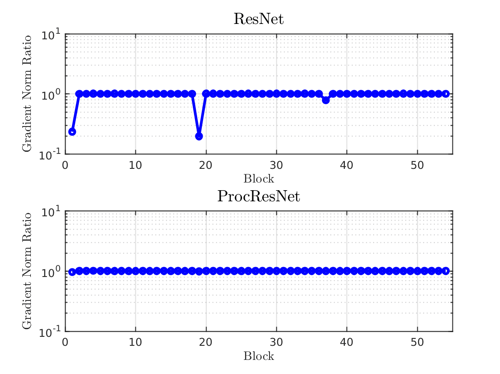

# Procrustes ResNet: ResNet with Norm-Preserving Transition Blocks
Implementation of Procrustes ResNet (ProcResNet) proposed in: 

Zaeemzadeh, Alireza, Nazanin Rahnavard, and Mubarak Shah. 
"Norm-Preservation: Why Residual Networks Can Become Extremely Deep?." [link](https://arxiv.org/abs/1805.07477)


## Requirements

Tested on:
- Python 2.7
- cuda 9.1 
- cupy 4.3
- chainer 4.3
- chainercv 0.10

## Quick Start

```bash
python train.py --model_file 'models/procresnet.py' --model_name 'ProcResNet166' --regul_freq 0.5 --gpus 0 1 --batchsize 128 --training_epoch 300 --lr_decay_epoch 150 225 --initial_lr 0.1 --dataset 'cifar10'
```

## About data augmentation

It performs various data augmentation using [ChainerCV](https://github.com/chainer/chainercv). 

See the details at `transform` function in `train.py`.

## About Regularization of the Conv Layers
The ProcResNet class has a method called 'regularize_convs', which is called after gradient descent update to enforce norm-preservation on the transition blocks.

See the details at `regularize_convs` function in `models/procresnet.py`.

Gradient norm ratio for ResNet (top) and ProcResNet (bottom):



## Exprimental Results

| model_name   |   depth |  #params|   error (%)         |
|:-------------|--------:|--------:|--------------------:|
| ResNet       |     164 |   1.71M |            5.46     |
| ResNet       |     1001|  10.32M |            4.62     |
| ProcResNet   |     166 |   1.72M |            4.75     |


## Citing This Work
If you find this work useful, please use the following BibTeX entry.
```
@article{zaeemzadeh2018norm,
  title={Norm-Preservation: Why Residual Networks Can Become Extremely Deep?},
  author={Zaeemzadeh, Alireza and Rahnavard, Nazanin and Shah, Mubarak},
  journal={arXiv preprint arXiv:1805.07477},
  year={2018}
}
```


